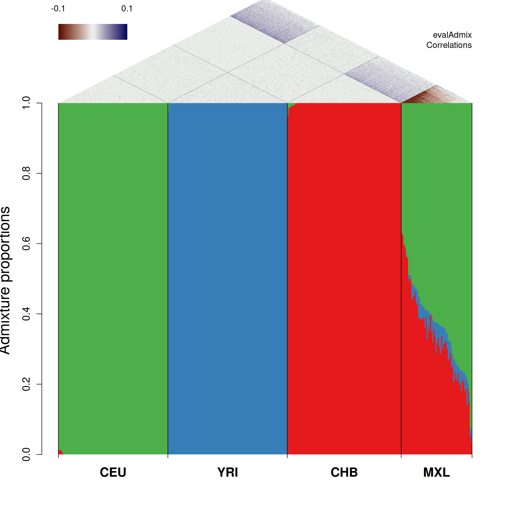
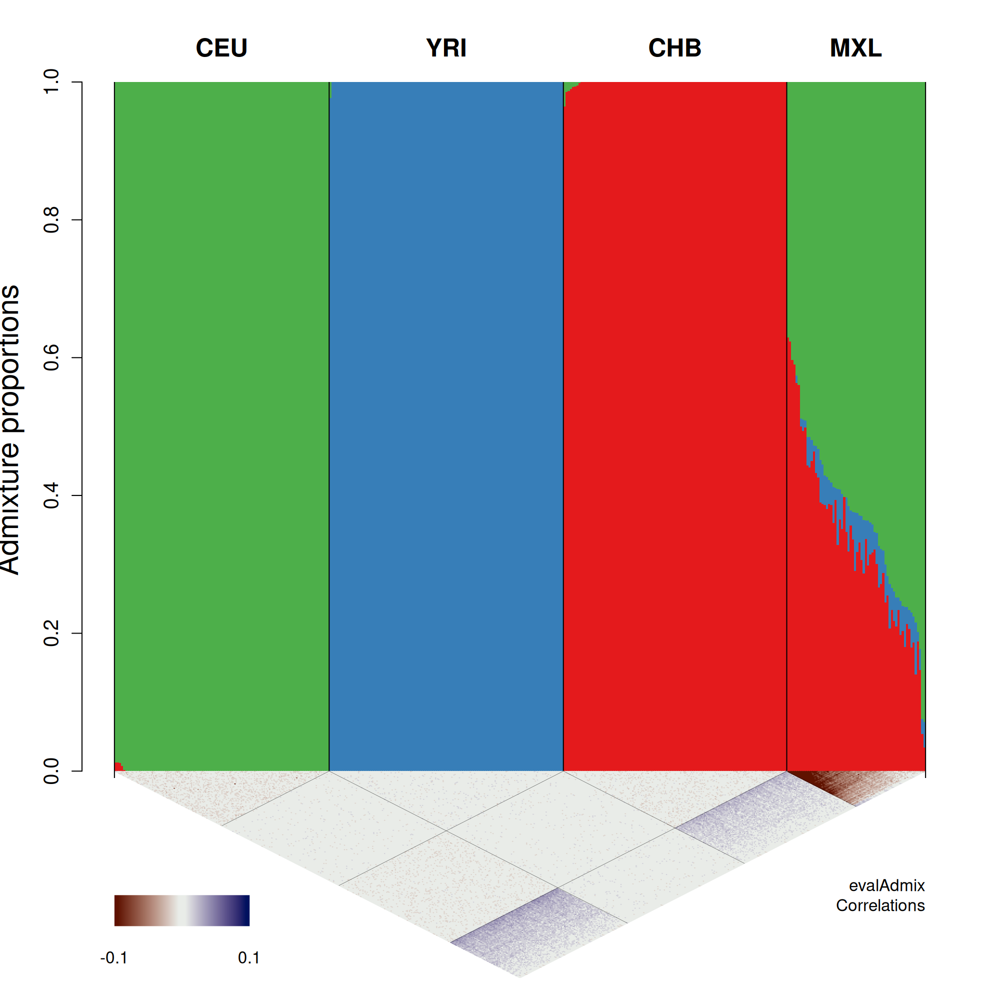
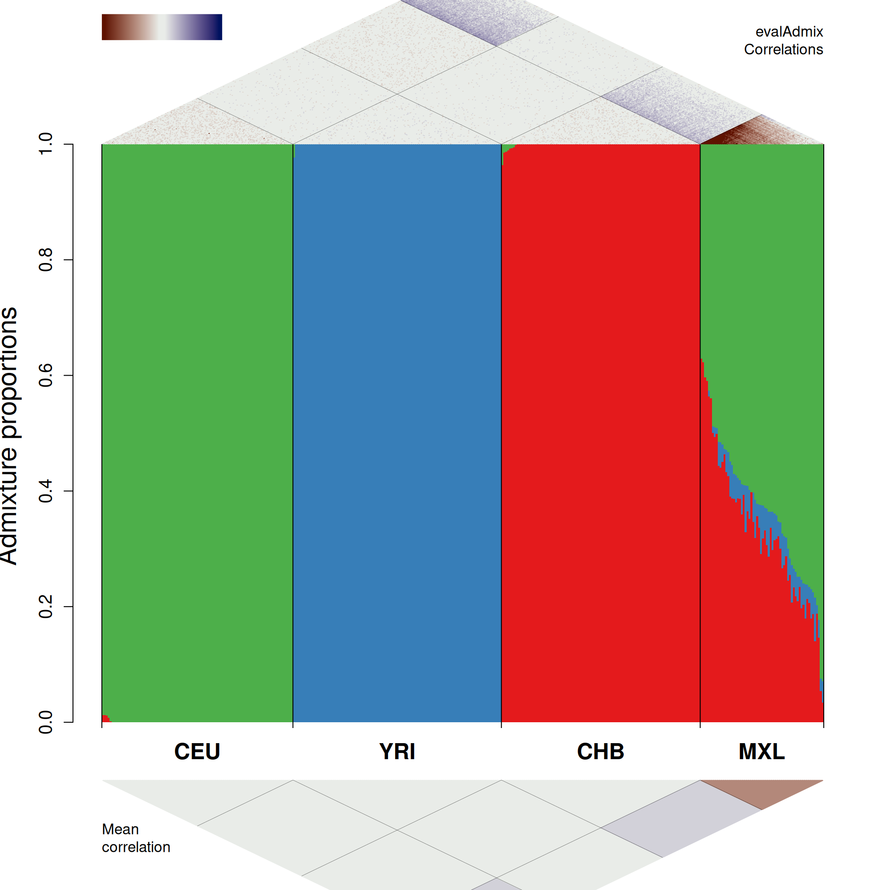

# aaplot example

This page shows how to use the plotting functions in [`aaplot_functions.R`](aaplot_functions.R) with the example data bundled with [`../evalAdmix`](../evalAdmix).

The example uses the `admixTjeck2` PLINK files, K=3 admixture proportions, K=3 ancestral allele frequencies, and an evalAdmix residual correlation matrix.

Generate the residual correlation matrix with:

```bash
cd evalAdmix
make
./evalAdmix \
  -plink data/admixTjeck2 \
  -fname data/admixTjeck2.3.P \
  -qname data/admixTjeck2.3.Q \
  -P 2 \
  -o ../aaplot_github/figures/admixTjeck2.corres.txt
```

All figures can be regenerated from the repository root with:

```bash
Rscript aaplot_github/make_figures.R
```

## Shared setup

The three examples below use the same data loading, ordering, and population-label setup.

```r
source("https://raw.githubusercontent.com/aalbrechtsen/Rfun/master/aaplot_github/aaplot_functions.R")
source("https://raw.githubusercontent.com/GenisGE/evalAdmix/master/visFuns.R")

data_prefix <- "evalAdmix/data/admixTjeck2"
cor_file <- "aaplot_github/figures/admixTjeck2.corres.txt"

pop <- read.table(paste0(data_prefix, ".fam"), stringsAsFactors = FALSE)
q <- read.table(paste0(data_prefix, ".3.Q"))
cor_mat <- as.matrix(read.table(cor_file))

pop_id <- pop[, 2]
ord <- orderInds(pop = as.vector(pop_id), q = q)
q <- q[ord, ]
pop_id <- pop_id[ord]
cor_mat <- cor_mat[ord, ord]

Q <- t(q)
pop_names <- unique(pop_id)
pop_id_int <- rep(seq_along(pop_names), table(pop_id)[pop_names])
pop_sep <- c(0, cumsum(table(pop_id_int)))
mean_pop_x <- pop_sep[-1] - table(pop_id_int) / 2

colorpal <- c(
  "#E41A1C", "#377EB8", "#4DAF4A", "#984EA3", "#FF7F00",
  "#FFFF33", "#A65628", "#F781BF", "#999999"
)
```

## Individual residual correlations above

The admixture barplot is shown below the pairwise residual correlation diamonds.

```r
png("aaplot_github/figures/aaplot_correlations_above.png", width = 2000, height = 2000, res = 200)
par(mar = c(5.1, 4.1, 10.1, 2.1))

x <- barplot(
  Q, col = colorpal, space = 0, border = NA, axisnames = FALSE,
  ylab = "Admixture proportions", xlab = "", main = "", xpd = NA,
  cex.axis = 1.2, cex.lab = 1.8, cex.main = 1.5
)
text(mean_pop_x, rep(-0.05, length(mean_pop_x)), unique(pop_id), xpd = TRUE, font = 2, cex = 1.5)
abline(v = pop_sep)
text(mean(x), 1.35, "Residual correlations above admixture proportions", font = 2, cex = 1.8, xpd = TRUE)
addKey(from = 1, to = 1.3, N = ncol(Q), maxCor = 0.1)
addCor(cor_mat, from = 1, to = 1.3, maxCor = 0.1, lines = 0.2, popID = pop_id)

dev.off()
```



## Individual residual correlations below

The same residual correlations can be placed below the admixture barplot by changing the `from` and `to` coordinates supplied to `addKey()` and `addCor()`.

```r
png("aaplot_github/figures/aaplot_correlations_below.png", width = 2000, height = 2000, res = 200)
par(mar = c(11.1, 4.1, 4.1, 2.1))

x <- barplot(
  Q, col = colorpal, space = 0, border = NA, axisnames = FALSE,
  ylab = "Admixture proportions", xlab = "", main = "", xpd = NA,
  cex.axis = 1.2, cex.lab = 1.8, cex.main = 1.5
)
text(mean_pop_x, rep(1.05, length(mean_pop_x)), unique(pop_id), xpd = TRUE, font = 2, cex = 1.5)
abline(v = pop_sep)
addKey(from = 0, to = -0.3, N = ncol(Q), maxCor = 0.1)
addCor(cor_mat, from = 0, to = -0.3, maxCor = 0.1, lines = 0.2, popID = pop_id)

dev.off()
```



## Individual and population mean correlations

This view combines individual residual correlations above the admixture plot with population-mean residual correlations below it.

```r
png("aaplot_github/figures/aaplot_individual_and_mean_correlations.png", width = 2000, height = 2000, res = 200)
par(mar = c(9.1, 4.1, 8.1, 2.1))

x <- barplot(
  Q, col = colorpal, space = 0, border = NA, axisnames = FALSE,
  ylab = "Admixture proportions", xlab = "", main = "", xpd = NA,
  cex.axis = 1.2, cex.lab = 1.8, cex.main = 1.5
)
abline(v = pop_sep)
addKey(from = 1, to = 1.3, N = ncol(Q), maxCor = 0.1)
addCor(cor_mat, from = 1, to = 1.3, maxCor = 0.1, lines = 0.2, popID = pop_id)
addCor(cor_mat, from = -0.1, to = -0.4, maxCor = 0.1, lines = 0.2, popID = pop_id, meanCor = TRUE)
text(0, -0.2, "Mean\ncorrelation", adj = 0, xpd = TRUE)
text(mean_pop_x, rep(-0.05, length(mean_pop_x)), unique(pop_id), xpd = TRUE, font = 2, cex = 1.5)

dev.off()
```


